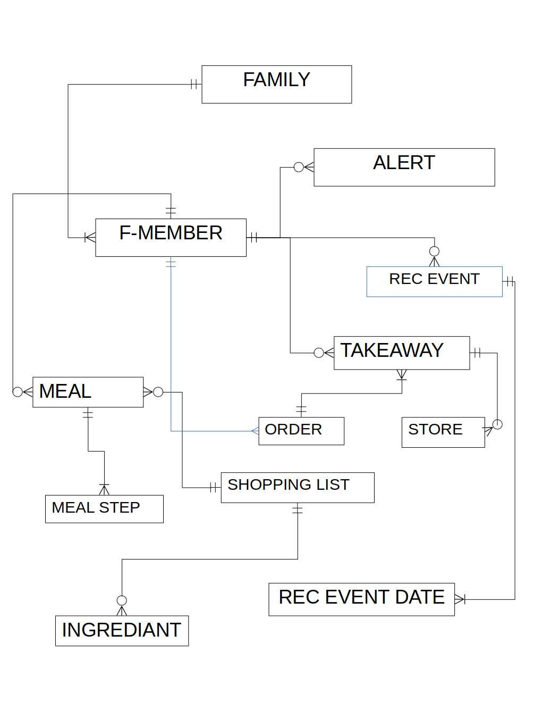

# family_planner
A app for scheduling family events and co-ordinating tasks

## App functionality
- A family can be created and joined
- A family member can create their own unique schedule 
- A family member can create events and tasks
- Family members can view and are alerted to upcoming events and tasks
- A family member can create a meal preperation/takeaway plan
- A family member can place an order within a takeaway
- All ingrediants all combined to form a shopping list

## Database Tables

**Alert**
- Id 
- Name
- Date
- Start time
- End time
- Type
- Description
- Img url
- Creator id

**Family**
- Id 
- Family name

**Family member**
- Id
- Family id
- Name
- Dob
- Role in family

**Meal**
- Id
- Name
- Date
- Family member id

**Meal step**
- Meal id
- Instruction
- Step no

**Ingrediant**
- Id
- Name
- Quantity
- Unit

**Shopping list**
- Meal id
- Ingrediant id

**TakeAway**
- Id
- Family member id
- Store id
- Date

**Order**
- Takeaway id
- Family member id
- Food

**Store**
- Id
- Name
- Address

**Recurring event**
- Family member id
- Id 
- Name
- Description

**Rec event datetime**
- Recurring event id
- Start
- End 

## Database Relationships

